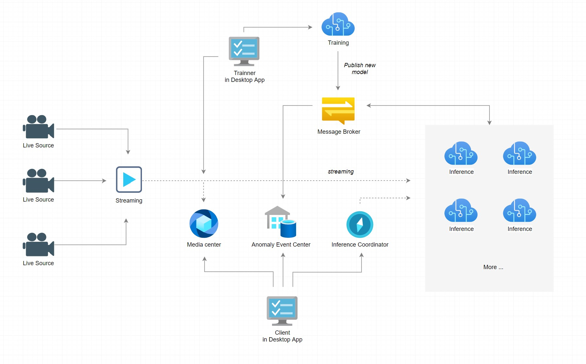

> 이 문서는 아직 작성 중입니다.

# 개요
이상 감지기(Anomaly Detector)는 CCTV와 같은 카메라로부터 송출되는 스트리밍을 실시간으로 분석하여 Anomaly를 검출합니다.

이 문서는 이상 감지기 구축에 대한 경험을 바탕으로 해당 시스템을 Architecturing한 사례를 이야기합니다. 
이것을 통해 이와 비슷한 시스템에서 발생할 수 있는 문제를 미연에 방지할 수 있습니다.
몇가지 범용적이지 않은 사항들은 제거되었지만 사례를 살펴보는데에 문제는 없다고 생각합니다.

제 사례는 여러분들이 구축해야하는 이상 감지기의 요구 사항과 다를 것입니다. 최대한 일반화된 내용을 다루기 위해 노력하였습니다.

또한 Micoroservices, SOA 또는 분산 아키텍처와 같은 내용을 배제합니다.
이 사례는 Service 단위의 Application 구성을 이야기하기에 구현에 대해 어느것을 선택해도 문제가 되지 않습니다.
그러나 특정 이유에서 Container 및 Kubernetes와 같은 Container Ochestration은 필수 항목으로 선택할 수 있습니다.

이상 감지기의 영상 분석을 위해 일반적으로 고전적인 방식의 Vision을 선택할 수도 있지만, 여기에서는 Machine Learning을 활용한 사례를 이야기합니다.

 

# Anomaly Detector (Sample)
제가 리드했던 이상 감지기 프로젝트는 영상 내 특정 관심 영역(이하 Roi)에서 발생하는 Anomaly를 감지합니다. 이러한 Roi는 한 영상 내 여러개일 수 있습니다. 또한 최초 관리자에 의해 설정되지만 실시간 분석을 통해 자동으로 미세 조정 될 수 있습니다.

이러한 미세 조정이 필요했던 이유는 촬영하는 카메라가 우리의 마음처럼 항상 고정된 모습을 유지하지 못하는 상황에 있었기 때문입니다.
이 말은 분석하고자 하는 환경과 Machine Learning의 Training 환경이 거리감을 가지게 된다는 것을 의미합니다. 그러므로 이러한 환경 대응 미세 조정은
전처리 역할로 수행되며 View Layer는 이를 반영하게 됩니다.

이 이상 감지기 프로젝트는 감지기뿐만 아니라 자체적인 Training과 Model 발행까지 포함합니다.

진행된 프로젝트는 Cloud에서 Hosting 되지 않았으며 자체적인 컴퓨팅 리소스 환경과 네트워크로 구성되었습니다.

카메라는 디지털 처리가 포함된 IP Camera가 사용되었으며 이 감지기가 처리하는 Camera는 50 ~ 100개로 유동적입니다.

 

# Architecture

* Streaming Service  
특정 네트워크 내에 사용가능한 Camera들을 Discovery 하고 Streaming 가능한 특정 Camera의 Endpoint를 재포장하여 노출합니다.

* Media center  
시스템의 모든 Streaming을 녹화합니다.
또한 과거 영상에 대한 열람을 제공합니다.

* Anomaly Event Center  
감지된 모든 Anomaly를 기록하고 열람할 수 있도록 합니다.

* Detector Aggregate & Detector Pool  
Detector Pool은 사용 가능하거나 검사 중인 Detector들이 위치합니다. Detector Aggregate는 검사 시작과 중지와 같은 명령을 처리하며 이를 위해 Detector Pool을 관리합니다.
(이는 Kubernetes의 기능으로 대체될 수 있습니다.)

* Client  
이 시스템의 Client는 100개 이상의 카메라를 Player로 표시하며 검사 시작과 중지 그리고 Anomaly가 발생한 지역을 확인할 수 있도록 합니다. 또한 발생했던 과거 Anomaly들을 확인할 수 있으며 그에 대한 영상을 열람할 수 있습니다.

* Message Broker  
Service들간의 통합 이벤트 (Integration Event)를 교환합니다. 저는 이 시스템 또한 일반적인 Microservices에서 해결법으로 사용되어지는 최종 일관성(Eventual consistency)으로 문제가 없다고 생각하였습니다. 

 

# 일급 데이터
이상 감지기 시스템에서 영상의 Frame 데이터는 일급 데이터로 취급해야합니다.  Live source들로부터 생성되어 이하 영역으로 전달 되는 모든 Frame은 일관성을 보장해야 합니다.

예를들어 Frame Data의 일관성이 보장되지 못한다면 Streaming을 구독하여 분석, 처리하는 이하 모든 Service들의 결과는 일치하지 않을 것입니다.

일치하지 않을 때 발생할 수 있는 한가지 예는 유지 보수 단계에 있습니다. 미검출된 Anomaly의 원인을 분석하려할때 기록되었던 과거 영상은 무용지물입니다. 발생했던 당시의 데이터와 기록된 데이터가 동일하지 않기 때문입니다.

이러한 이유로 인해 가장 첫번째로 구축해야하는건 Streaming에 대한 조정을 담당하는 Service입니다.

제가 사용했던 IP Camera는 다수의 구독자가 발생할 때 영상의 품질이 저하됩니다. 때때로 초당 Frame의 개수 또한 보장 받지 못했습니다. 또한 여러 구독자가 연결되었을때 각 구독자들에게 동일한 영상을 제공하지 못합니다. 이러한 문제 때문에 여러분은 실제 Live Source에 대한 Connection을 단 한개로 유지해야합니다. 

Streaming Service는 실제 Live Source와 단 한번의 연결점을 갖습니다. 그리고 시스템 내 다른 Service들이 구독할 수 있는 Endpoint를 노출합니다. Streaming Service는 이 Endpoint를 통해 구독하는 모든 Service들에게 동일한 Frame Data를 전달하게 됩니다. 앞서 언급했던 이유 때문에 이러한 Service는 필수 사항입니다. 여러분이 IP Camera를 사용한다면 이러한 사항은 피할 수 없을 것입니다.

또한 Stsreaming Service는 이 Frame data를 재 정의 합니다.
일반적으로 Streaming에서 사용하는 프로토콜 RTSP는 당시 Frame의 시간을 포함하지 않습니다. 그리고 제가 사용했던 Video codec 또한 그랬습니다. 그렇다고 구독하는 Service들에게 전달 받았던 시간을 사용하게해서는 안됩니다. Frame Data의 일관성이 깨지기 때문입니다. 

Streaming Service는 IP Camera로부터 수신받는 Frame에 Time stamp를 찍고 Endpoint를 통해 전달합니다. 제 사례에 경우, 이를 위해 이것을 위한 자체 Protocol을 정의하고 관련 Source code를 모듈로 작성하여 사용하였습니다.

제가 사용했던 .Net 5는 Buffer, RecyclingMemoryStream, ArrayPool, ObjectPool, Span과 같은 최적화 도구를 다량 지원하기에 매우 용이했습니다.

Streaming은 FPS만큼 일정한 수준으로 실시간 발송되기에 Source code 수준에서 이러한 Hot code path는 필수적인 최적화 대상입니다. 

또한 Service들간에 이 Frame Data가 이동하는 경로를 최소화하십시오.

다시 한번 말하지만, 이 시스템에서 Frame Data보다 중요한 Data는 없습니다.

# Inference Pool & Inference Aggregate

# Publish a new model

# 무중단 전략

